# 🧬 **Genomics Project**

Bioinformatics project for the "Genomics" course.  
This repository contains all datasets, commands, and analyses used in the project.

---

## 📖 **Description**

This project focuses on genome assembly, annotation and quality assessment of *Rhizoctonia solani* using multiple sequencing technologies (HiFi, Nanopore, and Illumina).

Rhizoctonia solani is a phytopathogenic fungus belonging to the order Cantharellales (formerly classified within Basidiomycota). It is widely distributed in soil and is responsible for diseases affecting many cultivated plants, such as seedling damping-off, root rot, and leaf spot diseases. Rhizoctonia solani has a broad host range, which makes it difficult to control in agriculture.  

The number of chromosomes in R. solani depends on the strain and ranges from 10 to 18. Strains AG8 and AG1 each possess 16 chromosomes. Genome size also varies among strains and ranges from 37 to 51 Mb. A significant portion of the genome consists of repetitive elements, which on average account for about 16% of the total DNA sequence. An interesting feature of this species is the ability of some strains to exist in a heterokaryotic form, meaning that their cells contain two different haploid nuclei, which increases their genetic diversity and adaptive potential.   

---

## 🧫 **Data**

### 🧬 **Reference genome**

Reference genome of *Rhizoctonia solani* AG-1 was downloaded using this command on the 29 Oct from the NCBI FTP:  
```
wget "https://ftp.ncbi.nlm.nih.gov/genomes/all/GCF/016/906/535/GCF_016906535.1_ASM1690653v1/GCF_016906535.1_ASM1690653v1_genomic.fna.gz"
```

Resulting file:  `GCF_016906535.1_ASM1690653v1_genomic.fna`
Shasum:  `87326de160c2cdf7436eef52a591c5abc4a1c1a8`


Reference genome of *Rhizoctonia solani* AG-8 was downloaded using this command on the 24 Nov from the NCBI FTP:
```
wget 'https://ftp.ncbi.nlm.nih.gov/genomes/all/GCA/000/695/385/GCA_000695385.1_RSAG8-1.V1/GCA_000695385.1_RSAG8-1.V1_genomic.fna.gz'
```

Resulting file:  `GCA_000695385.1_RSAG8-1.V1_genomic.fna`
Shasum:  `7ce7c33021e7f81b7c8d7967ac9946123a420476`

---

### 🧬 **HiFi reads**

HiFi **SRR34390379** reads were downloaded from [NCBI](https://trace.ncbi.nlm.nih.gov/Traces/?run=SRR34390379) on the 30 Oct 2025:
```
prefetch SRR34390379
fasterq-dump SRR34390379
```

Resulting file: `SRR34390379.fastq`  
Shasum: `f23b3523af9fe21aeef2066da8ba14444e2a0ea7`

---

### 🧬 **Nanopore reads**

Nanopore reads **SRR17331923** (GridION) were downloaded from [NCBI](https://trace.ncbi.nlm.nih.gov/Traces/?view=run_browser&acc=SRR17331923&display=metadata):
```
prefetch SRR17331923
fasterq-dump SRR17331923
```

Resulting file: `SRR17331923.fastq`  
Shasum: `c661512388e38debe5a84347e48f3b9e00c702ae`

---

### 🧬 **Illumina reads**

Illumina (HiSeq 2000) paired-end reads **SRR11560048** were downloaded from [NCBI](https://trace.ncbi.nlm.nih.gov/Traces/?view=run_browser&acc=SRR11560048&display=metadata) on 29 Oct 2025:
```
prefetch SRR11560048
fasterq-dump SRR11560048
```

Resulting files:  
`SRR11560048_1.fastq`  
`SRR11560048_2.fastq`

Shasum:  
- `400207f8cdc226f6040585bf38bd1d595a2cea36  SRR11560048_1.fastq`  
- `a89e8f9008a3a575ab8d01ccedc519795f22bdff  SRR11560048_2.fastq`


### 🧬 **Hi-C reads**

Hi-C paired-end reads **SRR34411203** were downloaded from [NCBI](https://www.ncbi.nlm.nih.gov/sra/SRX29574603[accn]) on 18 Nov 2025:
```
prefetch SRR34411203
fasterq-dump SRR34411203
```

Resulting files:
`SRR34411203_1.fastq`
`SRR34411203_1.fastq`

Shasum:
`73cabb6fe29875fffbada425544f662f07d33133 SRR34411203_1.fastq`
`2c44505e853a3ebbf3becb5ea1ccf327a346b063 SRR34411203_2.fastq`


### 🧬 **RNA-seq reads**

https://www.ncbi.nlm.nih.gov/sra/SRX3446646[accn]


---

## 🧪 **Quality control**

### **HiFi reads**

#### **FastQC**
```
fastqc SRR11560043.fastq
```
Results of quality control were ideal.


```
fastqc SRR34390379.fastq
```

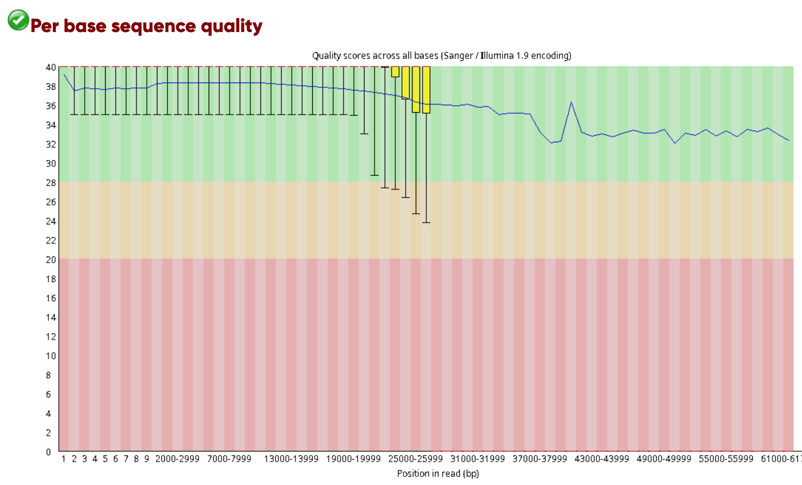

---

### **Nanopore**

#### **Preliminary QC**
```
NanoPlot --fastq SRR[number].fastq -o SRR[number]_nanoplot
```

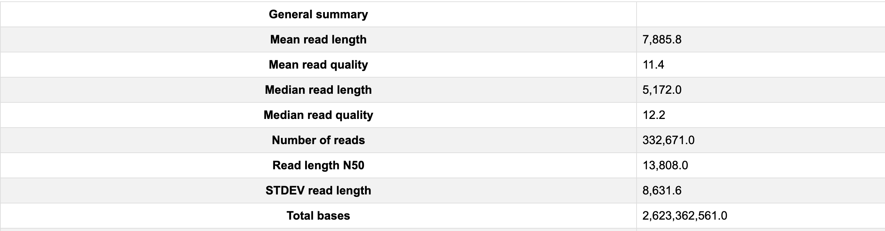

#### **Adapter trimming**
```
porechop -i SRR17331923.fastq -o SRR17331923_trimmed.fastq
```

**SRR17331923.fastq**  
- 322,194 / 332,671 reads had adapters trimmed from start (22,130,418 bp removed)  
- 187,323 / 332,671 reads had adapters trimmed from end (8,262,121 bp removed)  
- 1,287 / 332,671 reads were split  

#### **Reads filtering**
```
filtlong --min_length 1000 --keep_percent 90 SRR17331923_trimmed.fq > SRR17331923_clean.fastq
```

#### **QC after filtering**

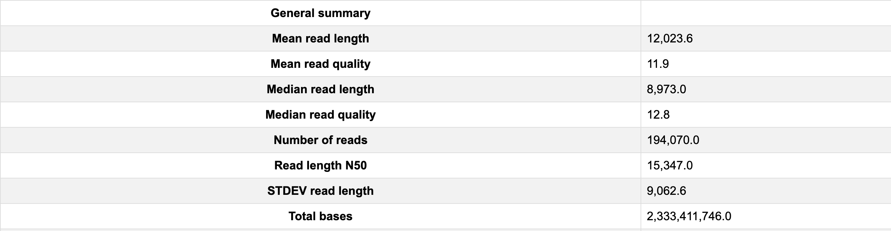

### **Illumina**

**SRR11560048**

#### **Preliminary FastQC**

```
fastqc SRR11560048_1.fastq
fastqc SRR11560048_2.fastq
```
Reports are stored in data/reads/FASTQC_REPORTS   
Reads were already preprocessed by authors  

#### **Fastp**

After obtaining reports preprocessing using Fastp was performed

```
fastp \
  -i SRR11560048_1.fastq \
  -I SRR11560048_2.fastq \
  -o SRR11560048_1.clean.fastq.gz \
  -O SRR11560048_2.clean.fastq.gz \
  --detect_adapter_for_pe \
  --trim_front1 0 \
  --trim_tail1 0 \
  --cut_tail \
  --cut_window_size 4 \
  --cut_mean_quality 20 \
  --qualified_quality_phred 15 \
  --thread 16
```
Fastp report is stored in data/reads/FASTP_REPORTS


#### **FastQC after preprocessing**

```
fastqc SRR11560048_1.clean.fastq.gz
fastqc SRR11560048_2.clean.fastq.gz
```
Reports are stored in data/reads/FASTQC_REPORTS 

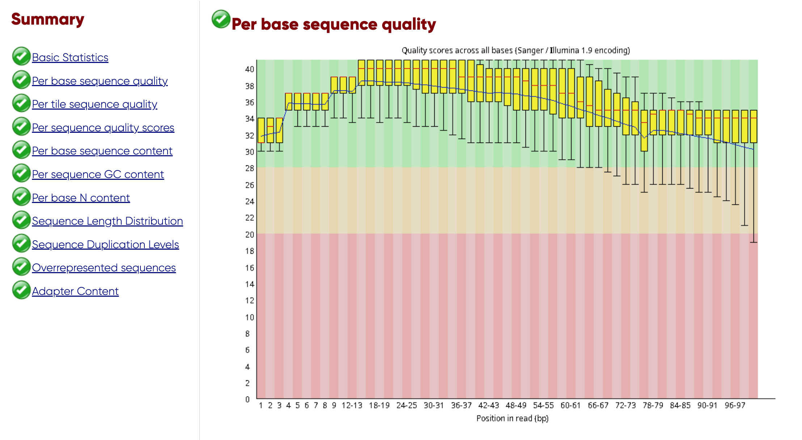

---

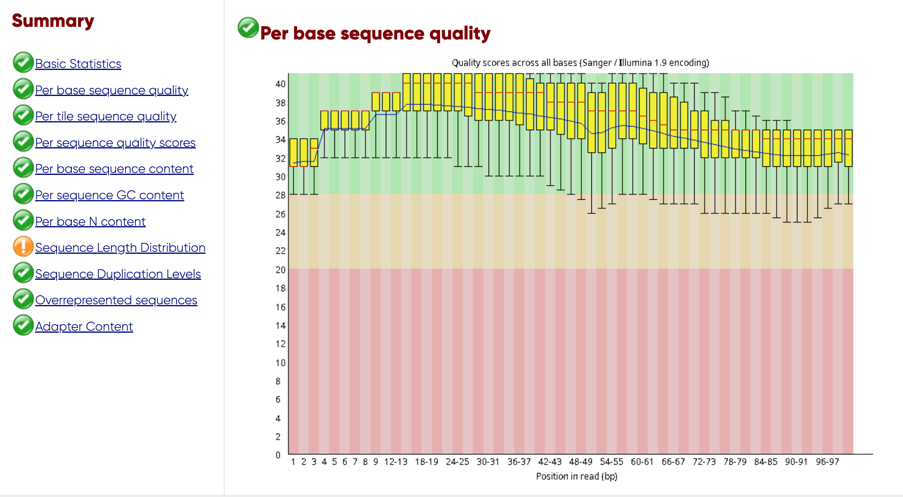


## 🧬 **Assembly**

### **SPAdes**

Assembly with Illumina paired-end reads:
```
spades.py -1 reads/Illumina/SRR11560048_1.fastq -2 reads/Illumina/SRR11560048_2.fastq -o spades_illumina_SRR11560048_pe --isolate
```

Assembly stats (`assembly-stats spades_illumina_SRR11560048_pe/contigs.fasta`):  
```
sum = 65398275, n = 292113, ave = 223.88, largest = 33176
N50 = 573
```

Assembly stats (`assembly-stats spades_illumina_SRR11560048_pe/scaffolds.fasta`):  
```
sum = 65623110, n = 289852, ave = 226.40, largest = 50535
N50 = 581
```

**Assembly visualization**
```
nucmer --maxmatch ref/GCF_016906535.1_ASM1690653v1_genomic.fna.fa assembly/spades_illumina_SRR11560048_pe/scaffolds.fasta -p nucmer_spades_illumina_SRR11560048

mummerplot -p dot_nucmer_spades_illumina_SRR11560048 -t png nucmer_spades_illumina_SRR11560048.delta
```
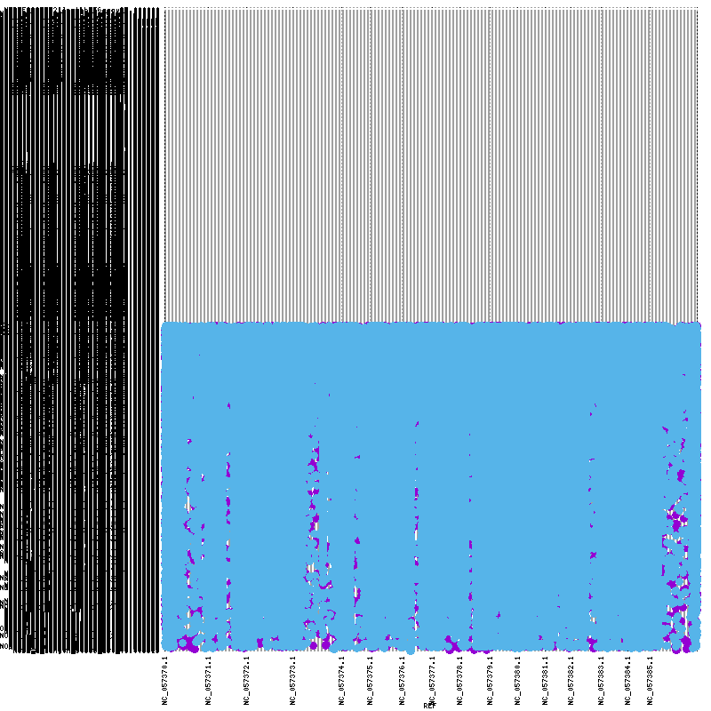


**Hybrid assembly**

```
spades.py -1 ../reads/Illumina/SRR8926039_1.clean.fastq -2 ../reads/Illumina/SRR8926039_2.clean.fastq --pacbio ../reads/HIFI/SRR34390379.fastq -o Hybrid_HIFI_SRR34390379_Illumina_SRR8926039 --isolate
```

---

### **SMARTdenovo**

#### **Nanopore reads**
```
smartdenovo.pl -p SMARTdenovo_nanopore_SRR17331923 -t 8 -c 1 reads/Nanopore/SRR17331923_clean.fastq > SMARTdenovo_nanopore_SRR17331923.mak
time make -f SMARTdenovo_nanopore_SRR17331923.mak
```

```
assembly-stats SMARTdenovo_nanopore_SRR17331923.dmo.cns
```

stats for SMARTdenovo_nanopore_SRR17331923.dmo.cns  
sum = 65586891, n = 480, ave = 136639.36, largest = 3385294  
N50 = 794686, n = 18  
N60 = 153302, n = 43  
N70 = 109601, n = 96  
N80 = 72570, n = 168  
N90 = 48564, n = 278  
N100 = 14123, n = 480  
N_count = 0  
Gaps = 0  

**Assembly visualization**
```
nucmer --maxmatch ref/GCF_016906535.1_ASM1690653v1_genomic.fna.fa assembly/SMARTdenovo_nanopore_SRR17331923/SMARTdenovo_nanopore_SRR17331923.dmo.cns -p SMARTdenovo_nanopore_SRR17331923_plot

mummerplot -p dot_SMARTdenovo_nanopore_SRR17331923_plot -t png SMARTdenovo_nanopore_SRR17331923_plot.delta
```
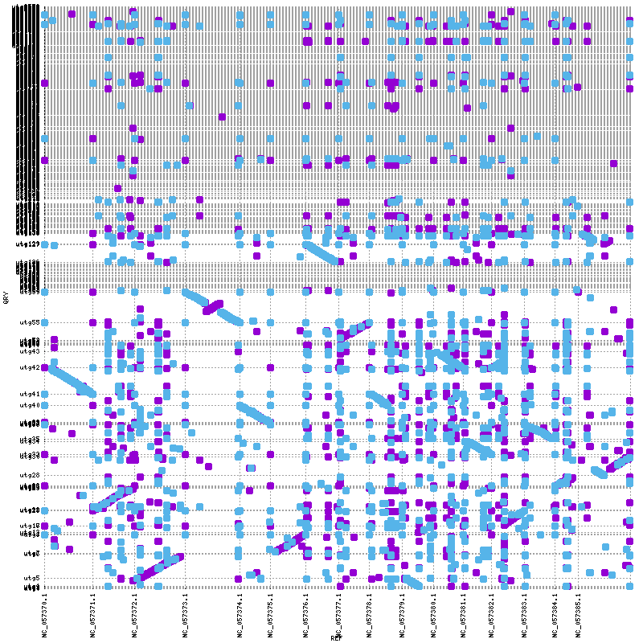

---

#### **HiFi reads**
**SRR11560043**
```
smartdenovo.pl -p SMARTdenovo_HIFI_SRR11560043 -t 8 -c 1 reads/HIFI/SRR11560043.fastq > SMARTdenovo_HIFI_SRR11560043.mak
time make -f SMARTdenovo_HIFI_SRR11560043.mak
```

```
assembly-stats SMARTdenovo_HIFI_SRR11560043.dmo.cns
```

stats for SMARTdenovo_HIFI_SRR11560043.dmo.cns  
sum = 52432191, n = 142, ave = 369240.78, largest = 2693633  
N50 = 761856, n = 19  
N60 = 593944, n = 26  
N70 = 404320, n = 37  
N80 = 260712, n = 53  
N90 = 144823, n = 80  
N100 = 14062, n = 142  
N_count = 0  
Gaps = 0  


**Assembly visualization**
```
nucmer --maxmatch ref/GCF_016906535.1_ASM1690653v1_genomic.fna.fa assembly/SMARTdenovo_HIFI_SRR11560043/SMARTdenovo_HIFI_SRR11560043.dmo.cns -p SMARTdenovo_HIFI_SRR11560043_plot

mummerplot -p dot_SMARTdenovo_HIFI_SRR11560043_plot -t png SMARTdenovo_HIFI_SRR11560043_plot.delta
```
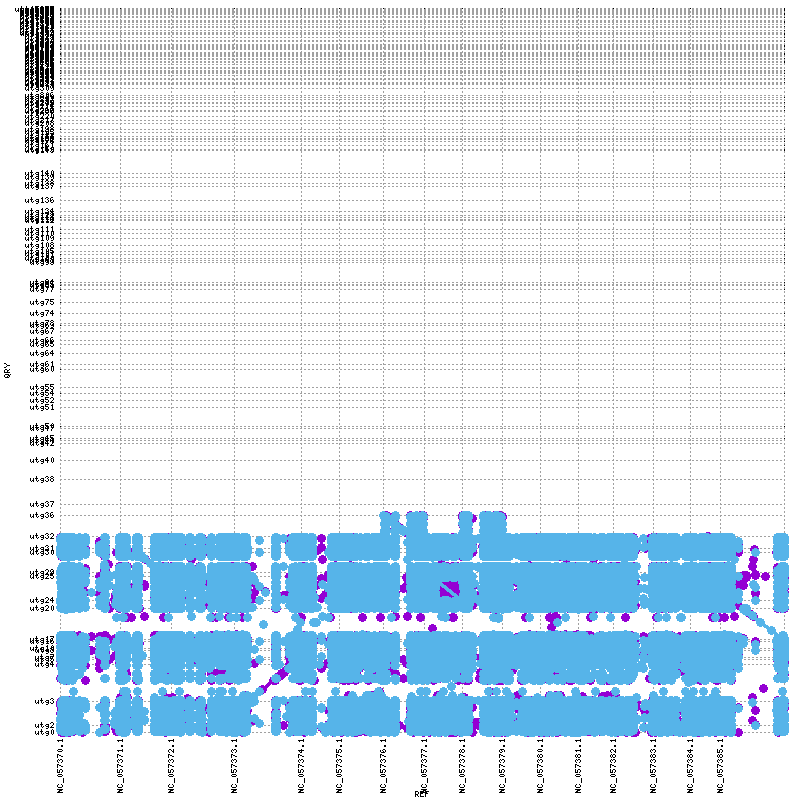

---

### **Minimap2**

#### **Nanopore reads**

```
time minimap2 -x ava-ont -t 10 reads/Nanopore/SRR17331923_clean.fastq reads/Nanopore/SRR17331923_clean.fastq|gzip -1 > assembly/Minimap2_nanopore_SRR17331923/Minimap2_nanopore_SRR17331923.paf.gz

miniasm -e2 -n1 -f reads/Nanopore/SRR17331923_clean.fastq assembly/Minimap2_nanopore_SRR17331923/Minimap2_nanopore_SRR17331923.paf.gz > assembly/Minimap2_nanopore_SRR17331923/miniasm_nanopore_SRR17331923.gfa

awk '/^S/{print ">"$2"\n"$3}' miniasm_nanopore_SRR17331923.gfa > miniasm_nanopore_SRR17331923.fa

assembly-stats miniasm_nanopore_SRR17331923.fa 
```

stats for miniasm_nanopore_SRR17331923.fa  
sum = 65527457, n = 812, ave = 80698.84, largest = 2389453  
N50 = 183020, n = 68  
N60 = 106608, n = 115  
N70 = 72827, n = 192   
N80 = 52178, n = 299  
N90 = 33121, n = 459  
N100 = 2152, n = 812  
N_count = 0  
Gaps = 0 

**Assembly visualization**
```
nucmer --maxmatch ref/GCF_016906535.1_ASM1690653v1_genomic.fna assembly/Minimap2_nanopore_SRR17331923/miniasm_nanopore_SRR17331923.fa
 -p assembly/Visualisation/Minimap2_nanopore_SRR17331923/Minimap2_nanopore_SRR17331923

mummerplot -t png -p dot_Minimap2_nanopore_SRR17331923 Minimap2_nanopore_SRR17331923.delta
```

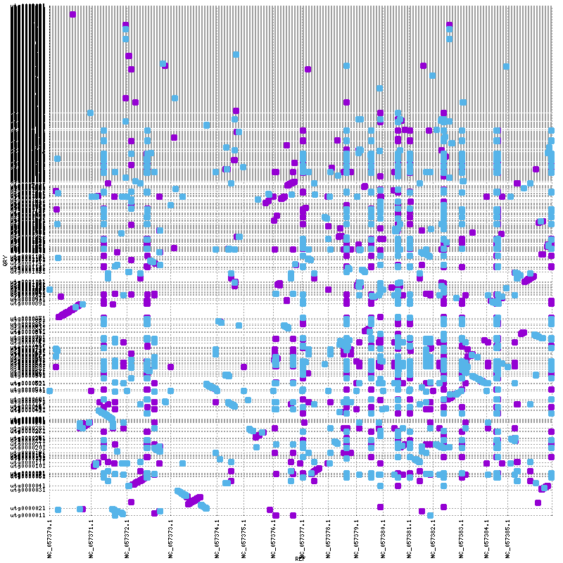

---

#### **HiFi reads**

```
time minimap2 -x ava-pb -t 10 reads/HIFI/SRR11560043.fastq reads/HIFI/SRR11560043.fastq|gzip =1 > assembly/Minimap2_HIFI_SRR11560043/Minimap2_HIFI_SRR11560043.paf.gz

miniasm -e2 -n1 -f reads/HIFI/SRR11560043.fastq assembly/Minimap2_HIFI_SRR11560043/Minimap2_HIFI_SRR11560043.paf.gz > assembly/Minimap2_HIFI_SRR11560043/miniasm_HIFI_SRR11560043.gfa

awk '/^S/{print ">"$2"\n"$3}' miniasm_HIFI_SRR11560043.gfa > miniasm_HIFI_SRR11560043.fa

assembly-stats miniasm_HIFI_SRR11560043.fa 
```

stats for miniasm_HIFI_SRR11560043.fa  
sum = 79841692, n = 988, ave = 80811.43, largest = 1215607  
N50 = 117368, n = 178  
N60 = 94095, n = 254  
N70 = 72464, n = 352  
N80 = 53781, n = 480  
N90 = 34281, n = 661  
N100 = 5001, n = 988  
N_count = 0  
Gaps = 0  


**Assembly visualization**  
```
nucmer --maxmatch ref/GCF_016906535.1_ASM1690653v1_genomic.fna assembly/Minimap2_HIFI_SRR11560043/miniasm_HIFI_SRR11560043.fa -p assembly/Visualisation/Minimap2_HIFI_SRR11560043/Minimap2_HIFI_SRR11560043

mummerplot -t png -p dot_Minimap2_HIFI_SRR11560043 Minimap2_HIFI_SRR11560043.delta
```

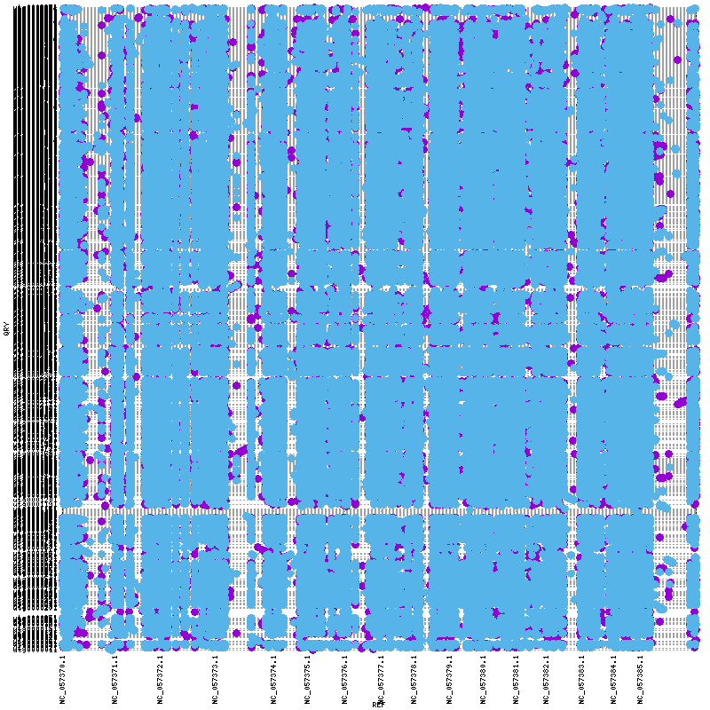


#### **Assemblies quality**

```
quast -r ref/GCF_016906535.1_ASM1690653v1_genomic.fna -l "spades_illumina_pe, smart_nanopore, smart_hifi, miniasm_nanopore, miniasm_hifi" assembly/spades_illumina_SRR11560048_pe/scaffolds.fasta assembly/SMARTdenovo_nanopore_SRR17331923/SMARTdenovo_nanopore_SRR17331923.dmo.cns assembly/SMARTdenovo_HIFI_SRR11560043/SMARTdenovo_HIFI_SRR11560043.dmo.cns assembly/Minimap2_nanopore_SRR17331923/miniasm_nanopore_SRR17331923.fa assembly/Minimap2_HIFI_SRR11560043/miniasm_HIFI_SRR11560043.fa
```

After obtaining results I decided to use hifiasm tool to reassembly genome using Hi-Fi and Hi-C reads.

---

### **Hifiasm**

**SRR34390379**
Assembly with Hi-C reads

```
hifiasm -o hifiasm_HIFI_SRR34390379_HIC_SRR34411203 -t 20 -l2 --h1 reads/HIC/SRR34411203_1.fastq --h2 reads/HIC/SRR34411203_2.fastq reads/HIFI/SRR34390379.fastq
```

Translating GFA to FASTA
```
awk '/^S/{print ">"$2"\n"$3}' hifiasm_HIFI_SRR34390379_HIC_SRR34411203.hic.p_ctg.gfa \
    > hifiasm_HIFI_SRR34390379_HIC_SRR34411203.hic.p_ctg.fa
```

```
assembly-stats hifiasm_HIFI_SRR34390379_HIC_SRR34411203.hic.r_utg.fa 
```

stats for hifiasm_HIFI_SRR34390379_HIC_SRR34411203.hic.p_ctg.fa  
sum = 57801716, n = 162, ave = 356800.72, largest = 4963576  
N50 = 3713043, n = 7  
N60 = 3110550, n = 9  
N70 = 2524926, n = 11  
N80 = 2259883, n = 14  
N90 = 686908, n = 17  
N100 = 14705, n = 162  
N_count = 0  
Gaps = 0

**Assembly visualization**  

nucmer --maxmatch ref/GCF_016906535.1_ASM1690653v1_genomic.fna.fa hifiasm_HIFI_SRR34390379_HIC_SRR34411203.hic.p_ctg.fa -p hifiasm_HIFI_SRR34390379_HIC_SRR34411203_plot

mummerplot -p dot_hifiasm_HIFI_SRR34390379_HIC_SRR34411203_plot -t png hifiasm_HIFI_SRR34390379_HIC_SRR34411203_plot.delta

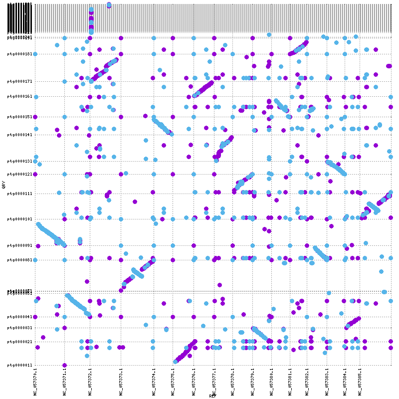


# QUAST

### **Reference genome: AG-1**
```
quast -r ref/GCF_016906535.1_ASM1690653v1_genomic.fna -l "spades_illumina_pe, smart_nanopore, smart_hifi, miniasm_nanopore, miniasm_hifi, hifiasm" assembly/spades_illumina_SRR11560048_pe/scaffolds.fasta assembly/SMARTdenovo_nanopore_SRR17331923/SMARTdenovo_nanopore_SRR17331923.dmo.cns assembly/SMARTdenovo_HIFI_SRR11560043/SMARTdenovo_HIFI_SRR11560043.dmo.cns assembly/Minimap2_nanopore_SRR17331923/miniasm_nanopore_SRR17331923.fa assembly/Minimap2_HIFI_SRR11560043/miniasm_HIFI_SRR11560043.fa assembly/Hifiasm_HIFI_SRR34390379_HIC_SRR34411203/hifiasm_HIFI_SRR34390379_HIC_SRR34411203.hic.p_ctg.fa
```
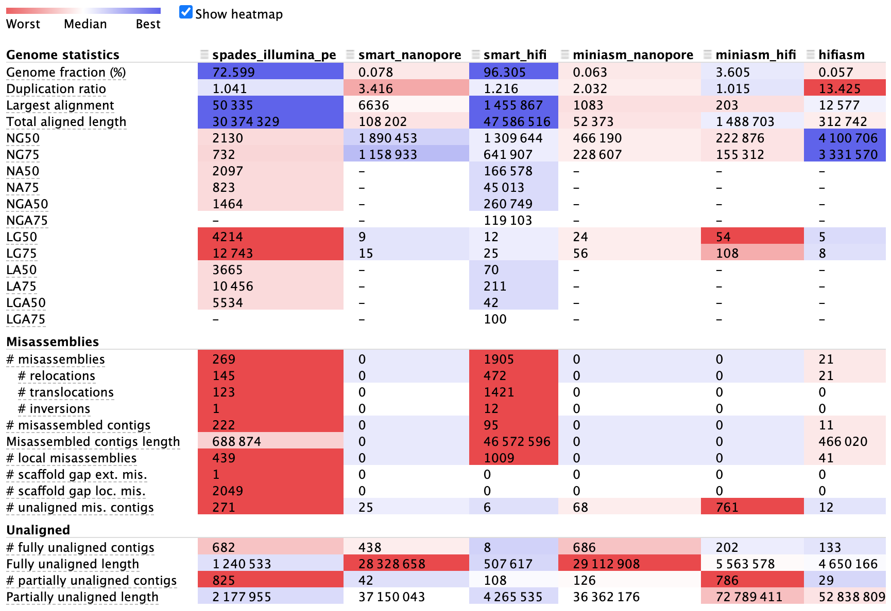
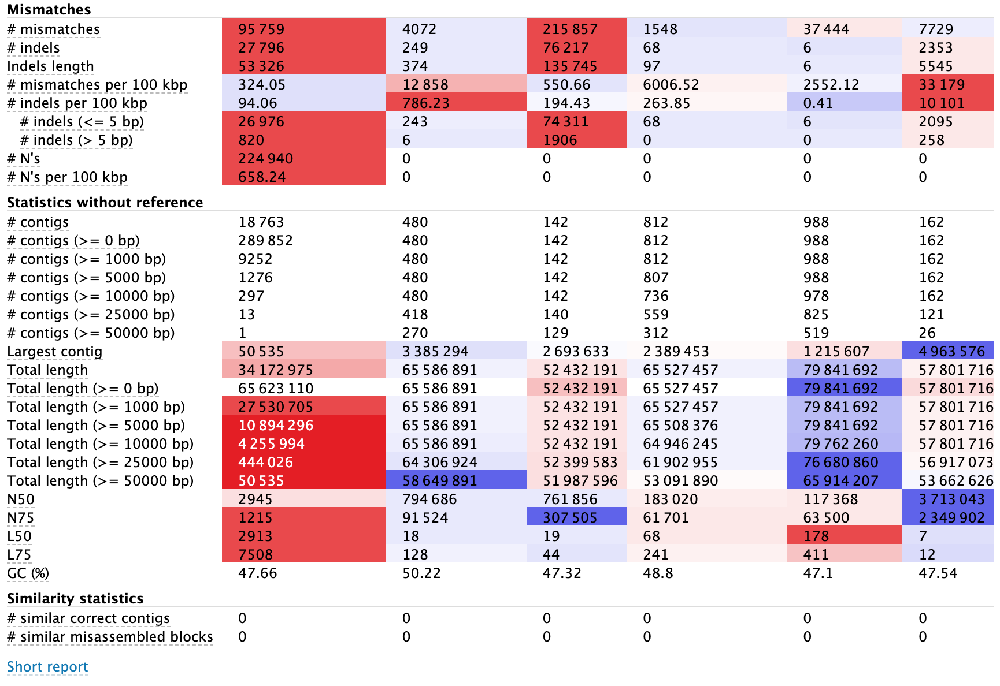


### **Reference genome: AG-8**
```
quast -r ref/GCA_000695385.1_RSAG8-1.V1_genomic.fna -l "spades_illumina_pe, smart_nanopore, smart_hifi, miniasm_nanopore, miniasm_hifi, hifiasm" assembly/spades_illumina_SRR11560048_pe/scaffolds.fasta assembly/SMARTdenovo_nanopore_SRR17331923/SMARTdenovo_nanopore_SRR17331923.dmo.cns assembly/SMARTdenovo_HIFI_SRR11560043/SMARTdenovo_HIFI_SRR11560043.dmo.cns assembly/Minimap2_nanopore_SRR17331923/miniasm_nanopore_SRR17331923.fa assembly/Minimap2_HIFI_SRR11560043/miniasm_HIFI_SRR11560043.fa assembly/Hifiasm_HIFI_SRR34390379_HIC_SRR34411203/hifiasm_HIFI_SRR34390379_HIC_SRR34411203.hic.p_ctg.fa
```
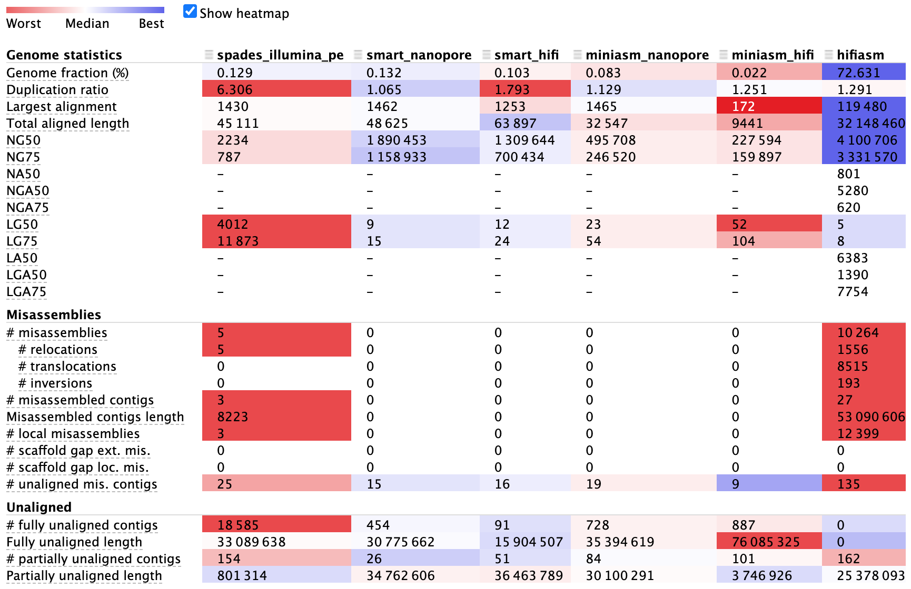
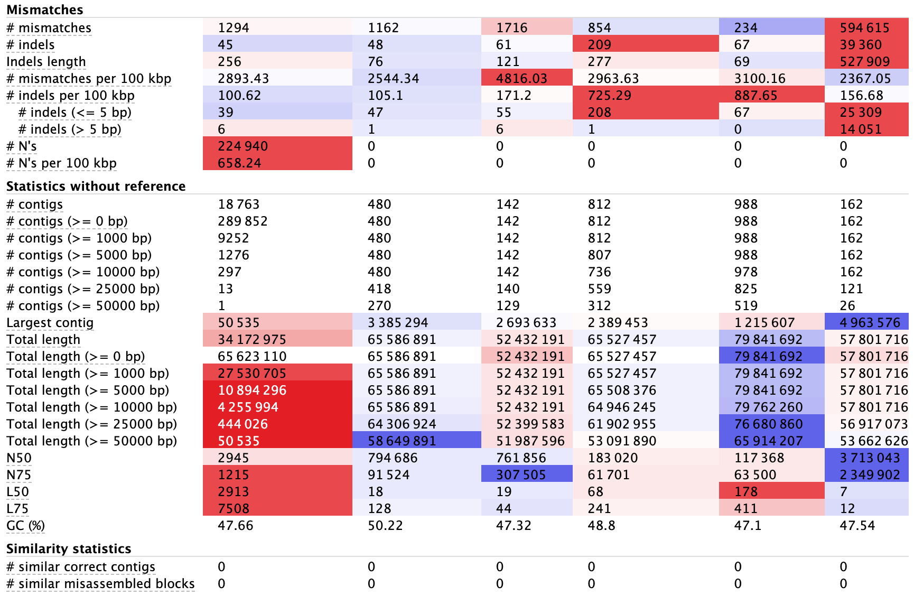


## **Polishing**

### **HiFi SRR34390379 + Hi-C SRR34411203 using Illumina SRR8926039 reads**

```
mkdir CORRECTED_Masurca_Hifiasm_HIFI_SRR34390379_HIC_SRR34411203_illumina_SRR8926039
cd CORRECTED_Masurca_Hifiasm_HIFI_SRR34390379_HIC_SRR34411203_illumina_SRR8926039
```

```
polca.sh -t 10 -a ../Hifiasm_HIFI_SRR34390379_HIC_SRR34411203/hifiasm_HIFI_SRR34390379_HIC_SRR34411203.hic.p_ctg.fa -r '../../reads/Illumina/SRR8926039_1.clean.fastq ../../reads/Illumina/SRR8926039_2.clean.fastq'
```


## **Scaffolding**

### **Chromosome scaffolder**
```
chromosome_scaffolder.sh -r ../../ref/GCF_016906535.1_ASM1690653v1_genomic.fna -q ../../assembly/CORRECTED_Masurca_Hifiasm_HIFI_SRR34390379_HIC_SRR34411203/hifiasm_HIFI_SRR34390379_HIC_SRR34411203.hic.p_ctg.fa.PolcaCorrected.fa -t 16 -nb -v
```

```
assembly-stats GCF_016906535.1_ASM1690653v1_genomic.fna.hifiasm_HIFI_SRR34390379_HIC_SRR34411203.hic.p_ctg.fa.PolcaCorrected.fa.split.reconciled.fa 
```

stats for GCF_016906535.1_ASM1690653v1_genomic.fna.hifiasm_HIFI_SRR34390379_HIC_SRR34411203.hic.p_ctg.fa.PolcaCorrected.fa.split.reconciled.fa  
sum = 57745292, n = 161, ave = 358666.41, largest = 4962671  
N50 = 3711849, n = 7  
N60 = 3109985, n = 9  
N70 = 2524214, n = 11  
N80 = 2259285, n = 14  
N90 = 686804, n = 17  
N100 = 14682, n = 161  
N_count = 0  
Gaps = 0  

### **SAMBA**

```
mkdir Samba_Scaffolded_CORRECTED_Masurca_Hifiasm_HIFI_SRR34390379_HIC_SRR34411203
cd Samba_Scaffolded_CORRECTED_Masurca_Hifiasm_HIFI_SRR34390379_HIC_SRR34411203/
```

```
samba.sh -r ../Scaffolded_CORRECTED_Masurca_Hifiasm_HIFI_SRR34390379_HIC_SRR34411203/GCF_016906535.1_ASM1690653v1_genomic.fna.hifiasm_HIFI_SRR34390379_HIC_SRR34411203.hic.p_ctg.fa.PolcaCorrected.fa.split.reconciled.fa -q ../../reads/Nanopore/SRR17331923_clean.fastq -d ont -t 16
```

```
assembly-stats GCF_016906535.1_ASM1690653v1_genomic.fna.hifiasm_HIFI_SRR34390379_HIC_SRR34411203.hic.p_ctg.fa.PolcaCorrected.fa.split.reconciled.fa.scaffolds.fa
```

stats for GCF_016906535.1_ASM1690653v1_genomic.fna.hifiasm_HIFI_SRR34390379_HIC_SRR34411203.hic.p_ctg.fa.PolcaCorrected.fa.split.reconciled.fa.scaffolds.fa
sum = 57745292, n = 161, ave = 358666.41, largest = 4962671  
N50 = 3711849, n = 7  
N60 = 3109985, n = 9  
N70 = 2524214, n = 11  
N80 = 2259285, n = 14  
N90 = 686804, n = 17  
N100 = 14682, n = 161  
N_count = 0  
Gaps = 0  


## **Quast**
After using chromosome scaffolder and Samba the quast comparison was performed

```
quast -r ref/GCF_016906535.1_ASM1690653v1_genomic.fna -l "hifiasm, corrected_hifiasm, scaffolded_hifiasm, samba_hifiasm" assembly/Hifiasm_HIFI_SRR34390379_HIC_SRR34411203/hifiasm_HIFI_SRR34390379_HIC_SRR34411203.hic.p_ctg.fa assembly/CORRECTED_Masurca_Hifiasm_HIFI_SRR34390379_HIC_SRR34411203/hifiasm_HIFI_SRR34390379_HIC_SRR34411203.hic.p_ctg.fa.PolcaCorrected.fa assembly/Scaffolded_CORRECTED_Masurca_Hifiasm_HIFI_SRR34390379_HIC_SRR34411203/GCF_016906535.1_ASM1690653v1_genomic.fna.hifiasm_HIFI_SRR34390379_HIC_SRR34411203.hic.p_ctg.fa.PolcaCorrected.fa.split.reconciled.fa assembly/Samba_Scaffolded_CORRECTED_Masurca_Hifiasm_HIFI_SRR34390379_HIC_SRR34411203/GCF_016906535.1_ASM1690653v1_genomic.fna.hifiasm_HIFI_SRR34390379_HIC_SRR34411203.hic.p_ctg.fa.PolcaCorrected.fa.split.reconciled.fa.scaffolds.fa
```

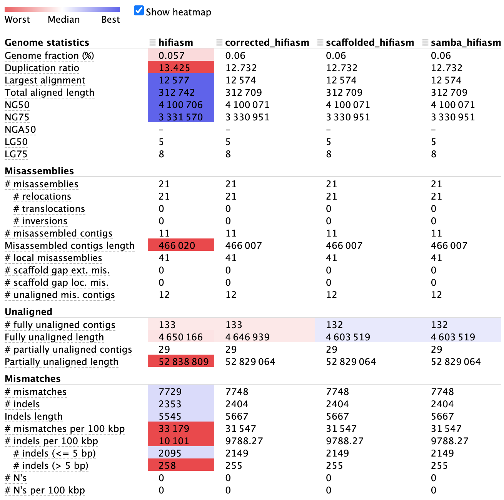
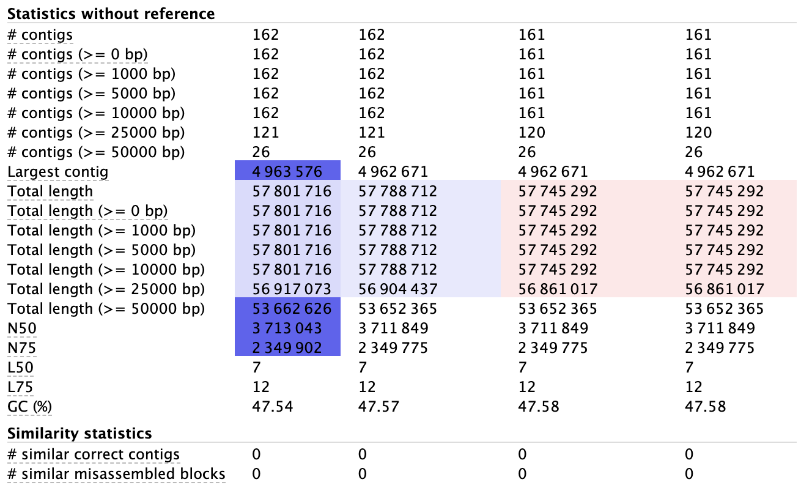


## **Bandage**

The Bandage app was used to illustrate genome assembly

*hifiasm_HIFI_SRR34390379_HIC_SRR34411203.hic.p_ctg.gfa*
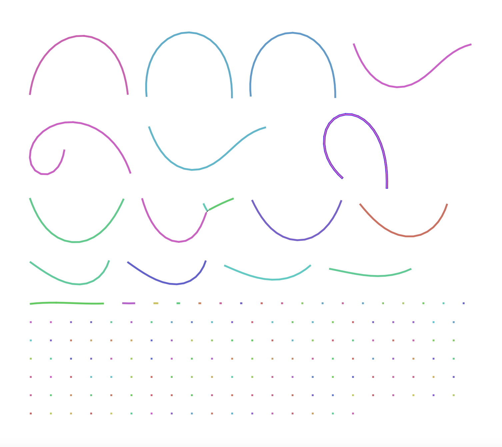


# **Genome Annotation**

## **Repeat masking**

Installation of TETools docker image

```
curl -sSLO https://github.com/Dfam-consortium/TETools/raw/master/dfam-tetools.sh
chmod +x dfam-tetools.sh
./dfam-tetools.sh
```

### **BuildDatabase**

```
BuildDatabase -name R.solani_repeats_db ../assembly/SAMBA/scaffolds_HiFI.fa
```


Resulting files:   
├── R.solani_repeats_db.nhr  
├── R.solani_repeats_db.nin  
├── R.solani_repeats_db.njs  
├── R.solani_repeats_db.nnd  
├── R.solani_repeats_db.nni  
├── R.solani_repeats_db.nog  
├── R.solani_repeats_db.nsq  
└── R.solani_repeats_db.translation  

### **RepeatModeler**

```
RepeatModeler -database R.solani_repeats_db -threads 16 -LTRStruct
```

### **RepeatMasker**

```
RepeatMasker  -pa 16  -lib RM_614054.TueDec161557312025/consensi.fa.classified -gff -xsmall  -no_is ../assembly/SAMBA/scaffolds_HiFI.fa 
```

```
cat scaffolds_HiFI.fa.tbl
```

| Parameter          | Value |
|------------------|---------|
| File name        | `scaffolds_HiFI.fa ` |
| Sequences        | 161     |
| Total length     | 57 745 292 bp |
| GC level         | 47.58 % |
| Bases masked     | 14 546 428 bp (25.19 %) |


| Repeat                           | Number | Length (bp) | Percent |
|----------------------------------|--------|-------------|---------|
| **Retroelements**                | 4 796  | 5 422 649   | 9.39 %  |
| SINEs                            | 51     | 12 835      | 0.02 %  |
| Penelope                         | 19     | 18 380      | 0.03 %  |
| LINEs                            | 385    | 185 493     | 0.32 %  |
| CRE/SLACS                        | 0      | 0           | 0.00 %  |
| L2/CR1/Rex                       | 0      | 0           | 0.00 %  |
| R1/LOA/Jockey                    | 109    | 32 089      | 0.06 %  |
| R2/R4/NeSL                       | 0      | 0           | 0.00 %  |
| RTE/Bov-B                        | 0      | 0           | 0.00 %  |
| L1/CIN4                          | 0      | 0           | 0.00 %  |
|                                  |        |             |         |   
| **LTR elements**                 | 4 341  | 5 205 941   | 9.02 %  |
| BEL/Pao                          | 0      | 0           | 0.00 %  |
| Ty1/Copia                        | 746    | 448 848     | 0.78 %  |
| Gypsy/DIRS1                      | 2 028  | 4 000 569   | 6.93 %  |
| Retroviral                       | 21     | 27 161      | 0.05 %  |
|                                  |        |             |         |   
| **DNA transposons**              | 902    | 800 790     | 1.39 %  |
| hobo-Activator                   | 59     | 28 716      | 0.05 %  |
| Tc1-IS630-Pogo                   | 132    | 66 639      | 0.12 %  |
| En-Spm                           | 0      | 0           | 0.00 %  |
| MULE-MuDR                        | 0      | 0           | 0.00 %  |
| PiggyBac                         | 0      | 0           | 0.00 %  |
| Tourist/Harbinger                | 110    | 59 088      | 0.10 %  |
| Other (Mirage, P-element, Transib) | 0    | 0           | 0.00 %  |
|                                  |        |             |         |   
| **Rolling-circles**              | 90     | 31 479      | 0.05 %  |
|                                  |        |             |         |   
| **Unclassified**                 | 13 457 | 7 614 738   | 13.19 % |
|                                  |        |             |         |   
| **Total interspersed repeats**   | —      | 13 838 177  | 23.96 % |
| Small RNA                        | 107    | 506 543     | 0.88 %  |
| Satellites                       | 0      | 0           | 0.00 %  |
| Simple repeats                   | 3 189  | 148 220     | 0.26 %  |
| Low complexity                   | 437    | 22 009      | 0.04 %  |


## **BRAKER**

### **Protein dataset**

First dataset was downloadaed from NCBI on 28 Nov 2025 using the following command:
```
datasets download genome taxon "1287688" --include protein --filename rhizo.zip
unzip rhizo.zip
```

Shasum:  
161a5d20cd01d530ce73c96ab031e627  protein.faa


Another protein database was downloaded from [OrthoDB](https://bioinf.uni-greifswald.de/bioinf/partitioned_odb11/) 11 on 28 Nov 2025 using the following command:
```
wget "https://bioinf.uni-greifswald.de/bioinf/partitioned_odb11/Fungi.fa.gz"
```

### **RNA-seq**

```
prefetch SRR34414162
fasterq-dump SRR34414162
```

Resulting files:  
`8b46774d280af869e7d5de25e79a59171315793c`  SRR34414162_1.fastq  
`10c124ccd3054d53f8233f786ba3b7fb5e5cab3c`  SRR34414162_2.fastq  


#### **Aligning with Hisat2**

```
cd genome_new/
hisat2-build scaffolds_HiFI.fa.masked genome_index
```

.
├── genome_index.1.ht2  
├── genome_index.2.ht2  
├── genome_index.3.ht2  
├── genome_index.4.ht2  
├── genome_index.5.ht2  
├── genome_index.6.ht2  
├── genome_index.7.ht2  
├── genome_index.8.ht2  
└── scaffolds_HiFI.fa.masked 

```
hisat2 -p 16 --dta -x ../genome_new/genome_index -1 SRR34414162_1.fastq  -2 SRR34414162_2.fastq | samtools sort -@ 16 -o rnaseq_SRR34414162.sorted.bam
samtools index rnaseq_SRR34414162.sorted.bam 
```

.  
├── rnaseq_SRR34414162.sorted.bam  
├── rnaseq_SRR34414162.sorted.bam.bai  
├── SRR34414162  
│   └── SRR34414162.sra  
├── SRR34414162_1.fastq  
└── SRR34414162_2.fastq  


### **BRAKER3 annotation**

Using OrthoDB11 proteins
```
cd braker
braker.pl --genome genome_new/scaffolds_HiFI.fa.masked --prot_seq proteins/OrthoDB11/Fungi.fa --bam rnaseq/rnaseq_SRR34414162.sorted.bam --threads 16 --workingdir ./braker_NEW_rna_protein &
```


## **BUSCO**

**Proteins**
```
busco -i braker/braker_NEW_rna_protein/braker.aa -l agaricomycetes_odb12 -o busco_NEW_braker_proteins -m proteins

busco --plot busco_NEW_braker_proteins
```

    ---------------------------------------------------
    |Results from dataset agaricomycetes_odb12         |
    ---------------------------------------------------
    |C:93.2%[S:80.0%,D:13.2%],F:0.9%,M:5.9%,n:3398     |
    |3166    Complete BUSCOs (C)                       |
    |2719    Complete and single-copy BUSCOs (S)       |
    |447    Complete and duplicated BUSCOs (D)         |
    |32    Fragmented BUSCOs (F)                       |
    |200    Missing BUSCOs (M)                         |
    |3398    Total BUSCO groups searched               |
    ---------------------------------------------------

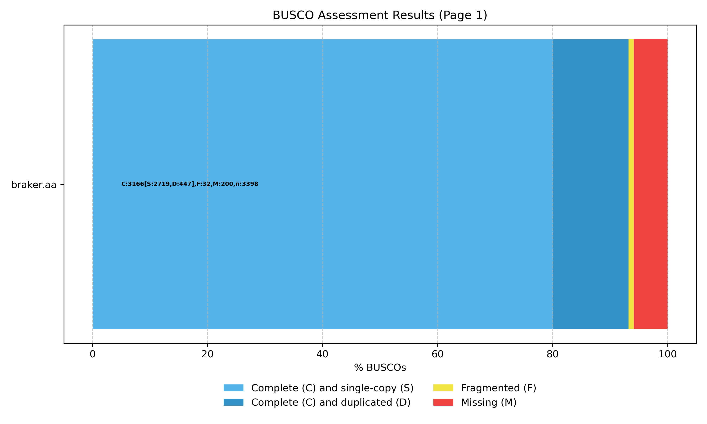


**Genome assembly**
```
busco -i assembly/SAMBA/scaffolds_HiFI.fa.masked -l agaricomycetes_odb12 -o busco_NEW_hifiasm_genome -m genome

busco --plot busco_NEW_hifiasm_genome
```

    -------------------------------------------------------------------------------------------
    |Results from dataset agaricomycetes_odb12                                                 |
    -------------------------------------------------------------------------------------------
    |C:87.1%[S:86.3%,D:0.8%],F:1.2%,M:11.6%,n:3398,E:42.5%                                     |
    |2961    Complete BUSCOs (C)    (of which 1257 contain internal stop codons)               |
    |2933    Complete and single-copy BUSCOs (S)                                               |
    |28    Complete and duplicated BUSCOs (D)                                                  |
    |42    Fragmented BUSCOs (F)                                                               |
    |395    Missing BUSCOs (M)                                                                 |
    |3398    Total BUSCO groups searched                                                       |
    -------------------------------------------------------------------------------------------


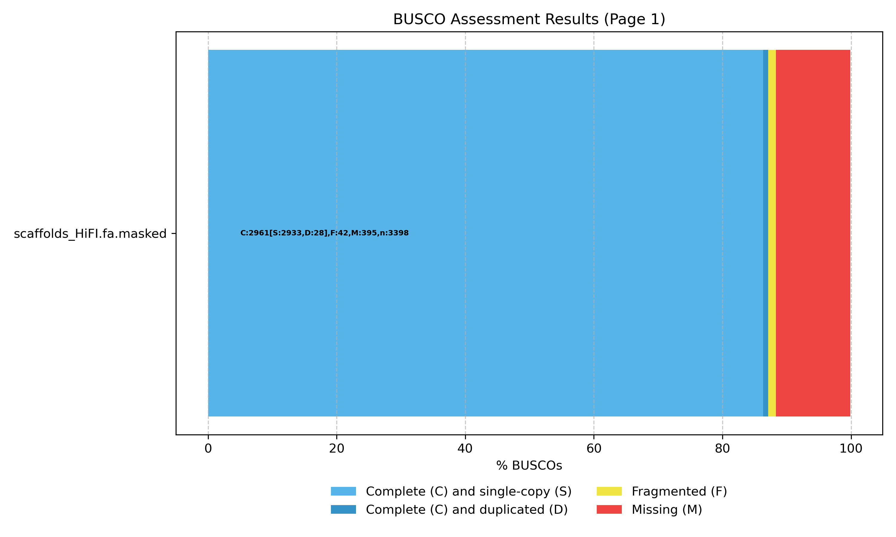


## **Functional Annotation**

### **EggNOG**  


Database download  
```
cd eggnog_db_NEW
wget http://eggnog5.embl.de/download/emapperdb-5.0.2/eggnog.db.gz    
wget http://eggnog5.embl.de/download/emapperdb-5.0.2/eggnog.taxa.tar.gz    
wget http://eggnog5.embl.de/download/emapperdb-5.0.2/eggnog_proteins.dmnd.gz 
```

```
gunzip eggnog.db.gz
gunzip eggnog_proteins.dmnd.gz
tar -xzf eggnog.taxa.tar.gz
```


```
cd ..
emapper.py \
  -i braker/braker_NEW_rna_protein/braker.aa \
  -o braker_NEW_eggnog \
  --data_dir eggnog_db_NEW \
  --itype proteins \
  --dmnd_db eggnog_db_NEW/eggnog_proteins.dmnd \
  --tax_scope Fungi \
  --cpu 16 &
```

To create a better annotation file a python script was designed.  

*scripts/add_eggnog_to_gtf.py*  

```
python scripts/add_eggnog_to_gtf.py -g braker/braker_NEW_rna_protein/braker.gtf -e eggnog_NEW/braker_NEW_eggnog.emapper.annotations -o braker_eggnog_new.gtf
```

```
cat braker_eggnog_new.gtf | grep -w "gene" | wc -l
```

New GTF file contains genes with information about GO and KEGG:  
*functional_annotation/new_braker.gtf*. 10937 of 13327 proteins were processed and annotated using EggNOG.  


## **Analyzis of genome assembly**  
The genome of Rhizoctonia solani consists of 16 chromosomes. In bandage it is clearly visible, that there are 16 big scaffolds and over 140 small contigs. After annotation of the genome many of   these small contigs remained unannotated.  

**scripts/sort_fasta.py**  
Sorts fasta sequences by length  

**scripts/check_scaffolds_without_genes.py**  
Takes FASTA and GTF files and checks which of the scaffolds are unannotated  

**scripts/split_fasta_by_annotations.py**  
Splits FASTA file into two depending on annotation  

**scripts/softmask_fasta_to_gtf.py**  
Creates GTF file with annotated reapeats  

**scripts/scaffold_stats.py**  
Creates a table with basic stats about each scaffold  


```
python scripts/sort_fasta.py -i assembly/SAMBA/scaffolds_HiFI.fa.masked -o assembly/SAMBA/sorted_scaffolds_HiFi.fa.masked
```

```
python scripts/check_scaffolds_without_genes.py -f assembly/SAMBA/sorted_scaffolds_HiFi.fa.masked -g braker/braker_NEW_rna_protein/braker.gtf -o unannotated_scaffolds_NEW.txt 
```
repeats_masked_NEW.gtf -> assembly/SAMBA

Annotated:      28  
Non-annotated: 134  


```
python scripts/softmask_fasta_to_gtf.py -f assembly/SAMBA/sorted_scaffolds_HiFi.fa.masked -o repeats_masked_NEW.gtf
```

✅ GTF file created: repeats_masked_NEW.gtf
✅ Total repeat regions annotated: 18103


```
python scaffold_stats.py -f ../assembly/SAMBA/scaffolds_HiFI.fa.masked -g braker/braker_NEW_rna_protein/braker.gtf -r repeats_masked.gtf -o scaffold_stats.tsv
```


```
sort -k2,2nr scaffold_stats.tsv > scaffold_stats_sorted_by_length.tsv

sed 's/\t/ | /g; 1s/^/| /; 1s/$/ |/' scaffold_stats_sorted_by_length.tsv | \
sed '2s/.*/|---|---|---|---|---|/' > table_scaffold_stats.md
```


| scaffold | length | repeat_percent | GC_percent | n_genes |
|---|---|---|---|---|
ptg000017l | 4416379 | 29.487 | 48.423 | 967
ptg000013l | 4262825 | 41.58 | 48.046 | 608
ptg000009l | 4221094 | 16.626 | 48.871 | 1147
ptg000010l | 4100071 | 15.697 | 49.169 | 1184
ptg000004l | 3736295 | 23.291 | 48.394 | 826
ptg000001l | 3711849 | 28.992 | 47.839 | 655
ptg000015l | 3330951 | 37.579 | 48.034 | 561
ptg000011l | 3109985 | 28.729 | 47.779 | 550
ptg000014l | 2808376 | 24.184 | 48.274 | 637
ptg000018l | 2524214 | 20.658 | 48.606 | 535
ptg000016l | 2349775 | 13.44 | 48.899 | 682
ptg000008l | 2324804 | 21.798 | 48.226 | 514
ptg000002l | 2259285 | 22.674 | 48.199 | 476
ptg000012l | 2044213 | 19.759 | 48.663 | 467
ptg000003l | 1805757 | 27.105 | 47.856 | 322
ptg000020l | 686804 | 43.712 | 47.976 | 72
ptg000005l | 314938 | 48.944 | 47.315 | 28
ptg000019l | 200231 | 49.644 | 46.995 | 7
ptg000022l | 116817 | 86.695 | 46.896 | 2
ptg000033l | 86817 | 0.473 | 35.971 | 0
ptg000060l | 66428 | 0.852 | 35.642 | 0
ptg000006l | 56362 | 0.394 | 35.056 | 0
ptg000035l | 54366 | 1.078 | 35.745 | 0
ptg000102l | 50907 | 0.605 | 35.975 | 0
ptg000048l | 50151 | 0.62 | 36.027 | 0
ptg000070l | 46302 | 0.674 | 36.046 | 0
ptg000038l | 46011 | 0.637 | 35.913 | 0
ptg000057l | 45728 | 0.551 | 36.059 | 0
ptg000128l | 44877 | 0.611 | 36.108 | 0
ptg000052l | 43607 | 0.672 | 36.191 | 0
ptg000100l | 43592 | 0.583 | 36.094 | 0
ptg000127l | 43565 | 0.803 | 35.728 | 0
ptg000054l | 43430 | 0.272 | 36.04 | 0
ptg000072l | 43398 | 0.629 | 36.762 | 0
ptg000093l | 43143 | 0.366 | 35.301 | 0
ptg000116l | 42962 | 99.998 | 46.562 | 0
ptg000065l | 42957 | 99.995 | 46.535 | 0
ptg000129l | 42896 | 0.977 | 36.164 | 0
ptg000132l | 42758 | 0.634 | 36.068 | 0
ptg000043l | 41307 | 0.663 | 36.384 | 0
ptg000026l | 41222 | 0.495 | 36.294 | 0
ptg000091l | 41100 | 0.81 | 36.331 | 0
ptg000034l | 40722 | 0.616 | 35.683 | 0
ptg000066l | 40672 | 0.617 | 36.118 | 0
ptg000080l | 40427 | 100.0 | 46.469 | 0
ptg000126l | 39460 | 0.281 | 36.189 | 0
ptg000123l | 39445 | 0.832 | 35.432 | 0
ptg000027l | 39232 | 100.0 | 46.429 | 0
ptg000087l | 39107 | 0.266 | 36.086 | 0
ptg000063l | 38359 | 0.308 | 35.269 | 0
ptg000030l | 38244 | 99.997 | 46.488 | 0
ptg000115l | 38091 | 0.816 | 35.323 | 0
ptg000085l | 37123 | 99.997 | 46.475 | 0
ptg000031l | 36951 | 0.26 | 35.179 | 0
ptg000024l | 36806 | 0.576 | 35.364 | 0
ptg000119l | 36714 | 0.907 | 36.594 | 0
ptg000135l | 35990 | 0.325 | 35.66 | 0
ptg000106l | 35403 | 0.599 | 35.5 | 0
ptg000053l | 35283 | 0.431 | 36.519 | 0
ptg000101l | 34920 | 0.776 | 36.312 | 0
ptg000081l | 34906 | 0.665 | 36.621 | 0
ptg000078l | 34859 | 0.413 | 36.507 | 0
ptg000047l | 34738 | 0.219 | 35.379 | 0
ptg000121l | 34221 | 0.418 | 36.723 | 0
ptg000134l | 34048 | 0.681 | 36.261 | 0
ptg000023l | 34015 | 1.37 | 36.316 | 0
ptg000109l | 33404 | 0.635 | 36.053 | 0
ptg000089l | 33327 | 0.636 | 35.185 | 0
ptg000083l | 33213 | 0.96 | 36.308 | 0
ptg000124l | 33147 | 0.29 | 35.379 | 0
ptg000082l | 32911 | 0.833 | 35.149 | 0
ptg000112l | 32849 | 0.947 | 35.334 | 0
ptg000142l | 32841 | 0.435 | 36.838 | 0
ptg000120l | 32810 | 0.552 | 35.117 | 0
ptg000059l | 32773 | 0.36 | 35.413 | 0
ptg000046l | 32560 | 0.771 | 36.265 | 0
ptg000055l | 32166 | 0.429 | 35.603 | 0
ptg000064l | 32116 | 0.377 | 35.362 | 0
ptg000099l | 31710 | 0.669 | 36.313 | 0
ptg000144l | 31696 | 0.24 | 35.086 | 0
ptg000062l | 31686 | 0.792 | 36.164 | 0
ptg000077l | 31626 | 0.794 | 36.059 | 0
ptg000111l | 31585 | 0.972 | 36.552 | 0
ptg000096l | 31576 | 0.795 | 36.233 | 0
ptg000056l | 31420 | 0.331 | 36.805 | 0
ptg000025l | 31354 | 0.801 | 35.858 | 0
ptg000137l | 31349 | 0.268 | 36.862 | 0
ptg000097l | 31115 | 1.494 | 36.201 | 0
ptg000040l | 31045 | 0.2 | 35.181 | 0
ptg000105l | 30949 | 0.811 | 35.423 | 0
ptg000073l | 30926 | 0.22 | 35.226 | 0
ptg000140l | 30815 | 0.445 | 35.619 | 0
ptg000041l | 30722 | 0.312 | 35.021 | 0
ptg000050l | 30567 | 0.438 | 35.679 | 0
ptg000103l | 30354 | 0.698 | 35.847 | 0
ptg000067l | 30200 | 0.831 | 35.649 | 0
ptg000039l | 29656 | 100.0 | 46.561 | 0
ptg000049l | 29390 | 0.646 | 37.009 | 0
ptg000114l | 29320 | 0.791 | 36.508 | 0
ptg000146l | 29282 | 0.857 | 35.295 | 0
ptg000149l | 29173 | 100.0 | 51.582 | 0
ptg000104l | 28789 | 0.736 | 35.191 | 0
ptg000141l | 28677 | 0.216 | 34.976 | 0
ptg000145l | 28010 | 0.432 | 35.252 | 0
ptg000113l | 27767 | 0.292 | 36.698 | 0
ptg000086l | 27709 | 0.372 | 36.259 | 0
ptg000095l | 27642 | 0.695 | 36.448 | 0
NC_057372.1 | 27209 | 99.996 | 46.485 | 0
ptg000118l | 26421 | 1.472 | 36.524 | 0
ptg000130l | 26002 | 100.0 | 46.573 | 0
ptg000143l | 25912 | 0.733 | 36.991 | 0
ptg000110l | 25771 | 0.404 | 36.246 | 0
ptg000156l | 25770 | 100.0 | 51.168 | 0
ptg000028l | 25695 | 0.405 | 36.626 | 0
ptg000139l | 25538 | 0.685 | 34.803 | 0
ptg000032l | 25450 | 0.833 | 35.741 | 0
ptg000107l | 25430 | 0.543 | 35.517 | 0
ptg000069l | 25378 | 99.996 | 46.532 | 0
ptg000092l | 25258 | 0.772 | 36.226 | 0
ptg000108l | 24985 | 0.136 | 34.377 | 0
ptg000148l | 24906 | 100.0 | 51.084 | 0
ptg000147l | 24833 | 0.387 | 35.67 | 0
ptg000058l | 24791 | 0.766 | 37.026 | 0
ptg000151l | 24640 | 64.663 | 50.195 | 3
ptg000161l | 24359 | 89.4 | 49.784 | 1
ptg000075l | 24189 | 0.314 | 35.661 | 0
ptg000125l | 24163 | 0.935 | 36.68 | 0
ptg000094l | 23962 | 0.413 | 34.404 | 0
ptg000159l | 23895 | 90.684 | 50.797 | 1
ptg000157l | 23794 | 85.828 | 50.483 | 0
ptg000117l | 23715 | 0.953 | 36.563 | 0
ptg000036l | 23681 | 1.119 | 34.762 | 0
ptg000076l | 23410 | 0.359 | 35.493 | 0
ptg000138l | 23166 | 0.328 | 35.733 | 0
ptg000158l | 23146 | 90.664 | 51.478 | 1
ptg000074l | 23125 | 0.99 | 36.718 | 0
ptg000037l | 22077 | 0.693 | 34.466 | 0
ptg000061l | 21946 | 1.208 | 34.512 | 0
ptg000136l | 21845 | 1.433 | 36.677 | 0
ptg000029l | 21822 | 1.938 | 36.66 | 0
ptg000071l | 21596 | 0.88 | 37.118 | 0
ptg000153l | 21387 | 68.537 | 51.134 | 1
ptg000150l | 21062 | 96.23 | 51.135 | 0
ptg000162l | 20979 | 99.995 | 50.57 | 2
ptg000068l | 20842 | 0.461 | 35.078 | 0
ptg000084l | 20643 | 0.465 | 35.189 | 0
ptg000152l | 20637 | 89.708 | 51.03 | 0
ptg000045l | 20418 | 99.961 | 46.376 | 0
ptg000154l | 20397 | 98.412 | 51.032 | 0
ptg000160l | 20345 | 95.935 | 50.342 | 0
ptg000122l | 19980 | 0.17 | 34.419 | 0
ptg000155l | 19210 | 92.79 | 50.812 | 2
ptg000090l | 19192 | 0.63 | 34.66 | 0
ptg000042l | 19051 | 1.202 | 36.203 | 0
ptg000131l | 18711 | 1.416 | 33.846 | 0
ptg000088l | 18096 | 1.265 | 36.439 | 0
ptg000098l | 17893 | 0.0 | 36.523 | 0
ptg000044l | 16746 | 1.367 | 37.089 | 0
ptg000079l | 15958 | 0.213 | 34.597 | 0
ptg000133l | 14682 | 1.294 | 35.458 | 0


After obtainig these results I decided to exclude short biologically   insignificatn scaffolds of length 20-90kb from final assembly. Additionally two files containing 16 and 20 scaffolds were created - GENOME_thin.fasta and GENOME_wide.fasta. Second file contains scaffolds that are not big enough to be chromosomes, but not too small to be excluded from genome assembly - they also contain annotated genes.   

These files are stored in data/RESULTS/genome_assembly   


## **Genome annotation statistics**

### **AGAT**

```
conda activate artale
conda install agat

agat_sq_stat_basic.pl --gff braker/braker_NEW_rna_protein/braker.gtf -g assembly/SAMBA/scaffolds_HiFI.fa > out_2_agat.txt
```

```
sed 's/\t/ | /g; 1s/^/| /; 1s/$/ |/' out_2_agat.txt | \
sed '2s/.*/|---|---|---|---|---|/' > agat_stats.md
```

| Type (3rd column) | Number | Size total (kb) | Size mean (bp) | % of the genome | 
|---|---|---|---|---|
**cds** | 87862 | 19022.20 | 216.50 | 32.94
**exon** | 87862 | 19022.20 | 216.50 | 32.94
**gene** | 11534 | 20470.34 | 1774.78 | 35.45
**intron** | 74550 | 5131.19 | 68.83 | 8.89
**mrna** | 975 | 1537.21 | 1576.62 | 2.66
**start_codon** | 13308 | 39.91 | 3.00 | 0.07
**stop_codon** | 13308 | 39.91 | 3.00 | 0.07
**transcript** | 13312 | 24153.39 | 1814.41 | 41.83
**Total** | 302711 | 89416.34 | 295.39 | 154.85


## **Circos**

First circos plot was made using modified script from Circos.ipynb  
`See in Project_genomics/data/Visual/Circos.ipynb`   

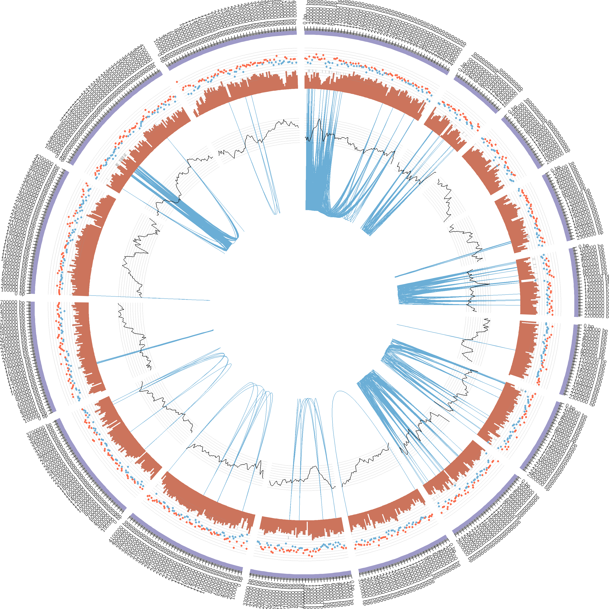


Second circos plot was made using another modified script from Circos.ipynb. It represents repeated 200-mers among whole genome.  
`See in Project_genomics/Visual_intergenomic_kmers/Circos.ipynb`

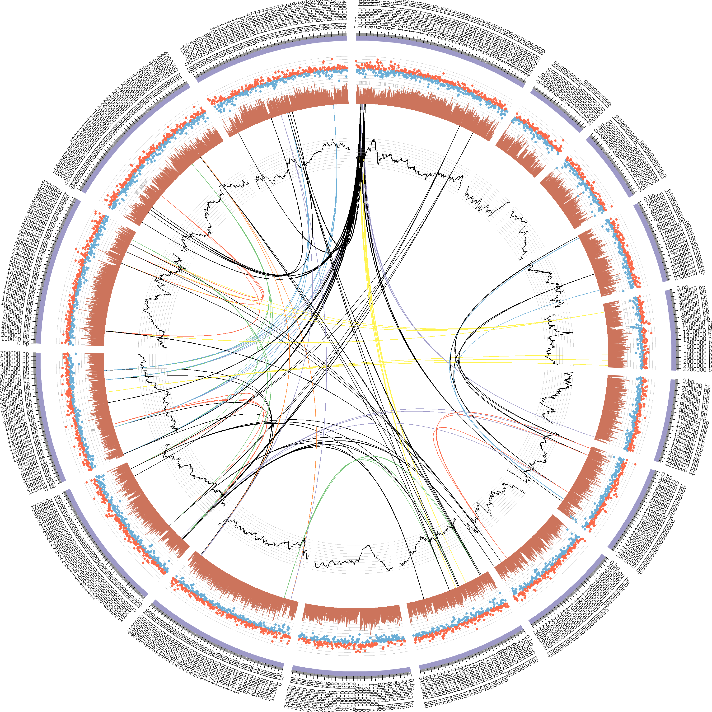

### **MCScanX**

To present the intergenomic collinear regions MCScanX tool was used  


**Formatting GTF file**
```
grep -P "\tCDS\t" braker.gtf | \
awk '{
    match($0, /gene_id "([^"]+)"/, a);
    gene=a[1];
    if(gene=="") next;
    if(!(gene in min)) { min[gene]=$4; max[gene]=$5 }
    else { if($4<min[gene]) min[gene]=$4; if($5>max[gene]) max[gene]=$5 }
    chrom[gene]=$1
} END {
}' > braker.mcscanx.gff chrom[g], g, min[g], max[g]
```


In this gff file we are keeping only genes annotated on 16 chromosomes that can be seen in RESULTS/genome_assembly/GENOME_thin.fasta   
```
grep -Ff keep_scaffolds_thin.txt braker.mcscanx.gff > genome.mcscanx.filtered.gff
```

**Intermediate file to keep gene names**   
```
grep -P "\tCDS\t" braker.gtf | \
awk '{
    match($0, /transcript_id "([^"]+)"; gene_id "([^"]+)"/, a);
    transcript=a[1]; gene=a[2];
    if(transcript=="") next;
    print transcript, gene
}' > trans2gene.txt
```

**Creating file containing proteins with names from trans2gene.txt**  
```
awk 'BEGIN{
      while((getline<"trans2gene.txt")>0) map[$1]=$2
     }
     /^>/{ 
        seq_id=substr($1,2);
        if(seq_id in map) { print ">"map[seq_id] } else {print $0} ; next
     }
     {print}
' braker.fa > genome.mcscanx.fa
```


**Creating database and BLAST**
```
diamond makedb --in braker.mcscanx.fa -d genome

diamond blastp \
    -d genome \
    -q braker.mcscanx.fa \
    -o genome.blast \
    -e 1e-5 \
    --outfmt 6 \
    --max-target-seqs 5
```
```
mv genome.mcscanx.fa gen/
mv genome.mcscanx.filtered.gff gen/
mv genome.blast gen/
```


**Running MCScanX**
```
./MCScanX ../mcscanx/gen/genome
```

Creating .links file for circos
```
cd gen/

awk 'BEGIN{OFS="\t"} {gene=$2; chr=$1; start=$3; end=$4; gene_pos[gene]=chr"\t"start"\t"end} END{for(g in gene_pos) print g, gene_pos[g]}' genome.mcscanx.filtered.gff > gene_positions.tsv

grep -P "^\s+\d+-" genome.collinearity | awk -F"\t" '{gsub(":", "", $1); print $2, $3}' > collinearity_pairs.tsv

sed 's/ \+/\t/g' collinearity_pairs.tsv > collinearity_pairs_tab.tsv 

awk 'BEGIN{FS=OFS="\t"}                                              
FNR==NR {chr[$1]=$2; start[$1]=$3; end[$1]=$4; next} 
{g1=$1; g2=$2; if(g1 in chr && g2 in chr) print chr[g1], start[g1], end[g1], chr[g2], start[g2], end[g2]}' gene_positions.tsv collinearity_pairs_tab.tsv > circos.links.txt
```


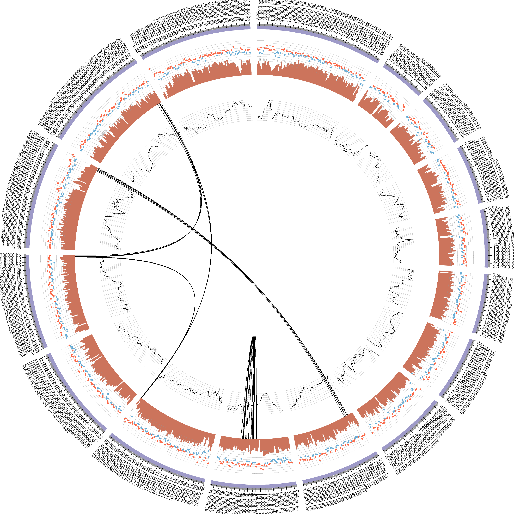


## **Few more analysis**

**GENOME_thin**

```
nucmer --maxmatch ref/GCF_016906535.1_ASM1690653v1_genomic.fna RESULTS/genome_assembly/GENOME_thin.fasta -p GENOME_thin_plot

mummerplot -p dot_GENOME_thin_plot -t png GENOME_thin_plot.delta 
```
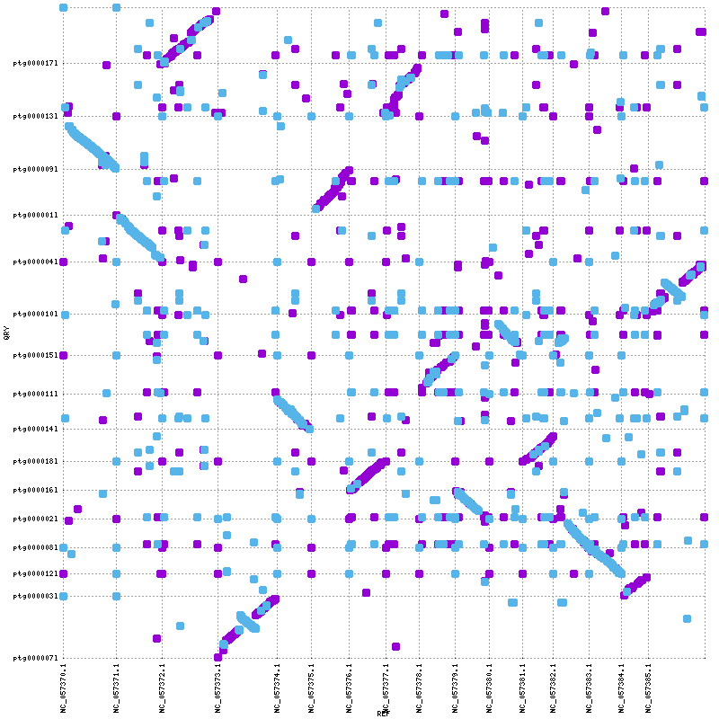


**GENOME_wide**

```
nucmer --maxmatch ref/GCF_016906535.1_ASM1690653v1_genomic.fna RESULTS/genome_assembly/GENOME_wide.fasta -p GENOME_wide_plot

mummerplot -p dot_GENOME_wide_plot -t png GENOME_wide_plot.delta 
```
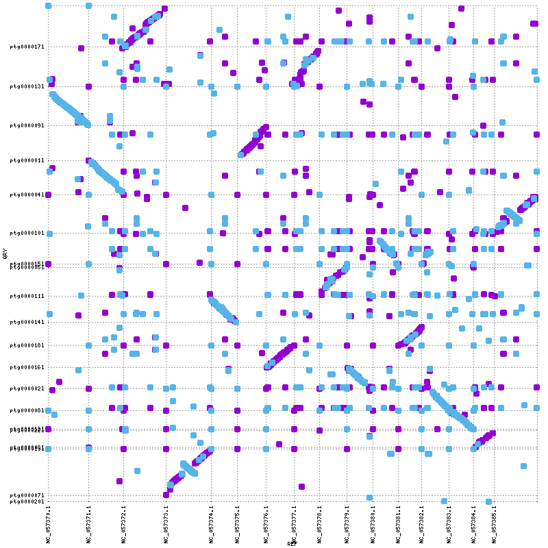


**GENOME_unsure**

```
nucmer --maxmatch ref/GCF_016906535.1_ASM1690653v1_genomic.fna RESULTS/genome_assembly/GENOME_unsure.fasta -p GENOME_unsure_plot

mummerplot -p dot_GENOME_unsure_plot -t png GENOME_unsure_plot.delta 
```
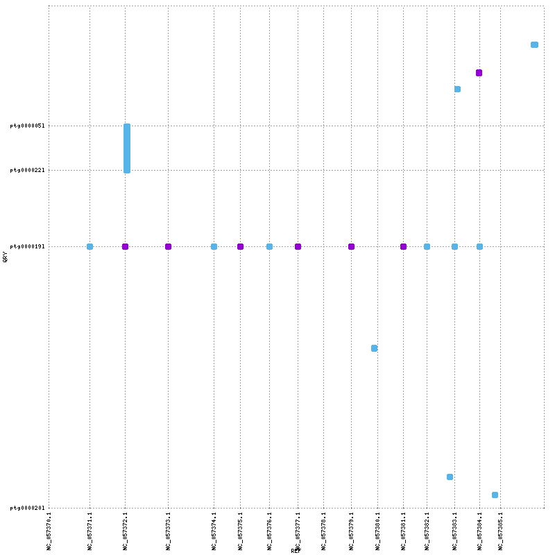

